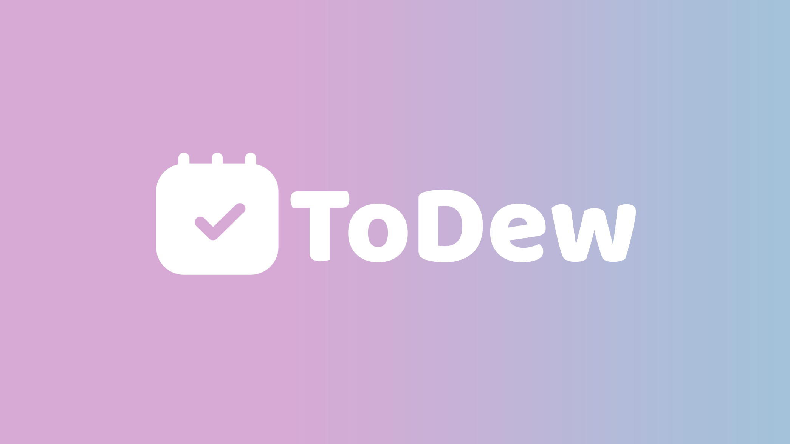

# ToDew
features edit dialogue, delete todo, tooltips using tippy.js, and custom form validation using angular

> ToDew is a to-do site that features:
- [x] Ability to create, edit, and delete any number of to do items
- [x] Custom edit dialog using Angular
- [x] Custom form validation (no blank items, no whitespace only, minimum 2 character count)
